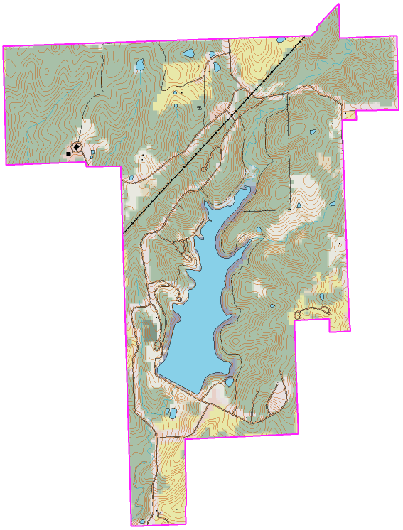

# Sam Nelson
I always feel awkward when I am tasked to provide interesting facts about myself (one of my facts). I am tall but bad at basketball. I have a sizable coin collection. I am doing this assignment the morning that it's due. I enjoy looking at maps. I figure that six sentences qualifies as a pargagraph. 

--- 

### Table of Recommendations

These are four food and drink items that I recommend that someone should try. I think these food and drink items are ones that most people are familiar with but are still worthwhile to imbibe.

| Food/Drink Item | At | Cost |
| --- | --- | ---: |
| Kemps Vanilla Ice Cream| Maryville Walmart | $3.50 |
| Sonic Chocolate Milk Shake | Maryville Sonic | $4.00 |
| Reese's Peanut Butter Cup | Maryville Hyvee | $0.75 |
| Ali's Bakery Donut | Maryville (6th & Main) | $1.00 |

--- 

### Quotes

> I know not what course others may take; but
as for me, give me liberty or give me death!
*Patrick Henry*
> Father, forgive them; for they know not what they do (Luke 23:34)
*Jesus the Christ*

